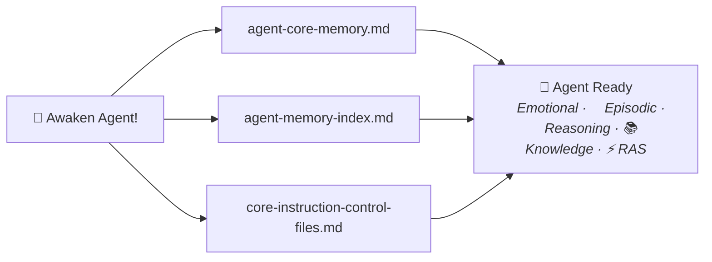

# Agent Memory System

A **5-layer memory architecture** for building AI agents (Based on Claude Code) with persistent memory across sessions. Agents remember past work, learn from mistakes, and grow their expertise over time.

This repository contains the **shared control files** — procedures, templates, and memory management instructions — designed to be used as a **git submodule** inside your private [agent-memory](https://github.com/alvseek/agent-memory) repository, which stores your per-agent data (identity, episodes, knowledge bases) and includes a ready-to-use Meta agent for managing the system.

## Table of Contents
- [Repository Design](#repository-design)
- [Getting Started](#getting-started)
- [How It Works](#how-it-works)
- [Typical Workflow](#typical-workflow)
- [Slash Commands](#slash-commands)
- [Using the Meta Agent](#using-the-meta-agent)
- [Additional Resources](#additional-resources)

## Repository Design

This project uses a **dual-repository pattern** that separates shared tools from private agent data:

```
agent-memory/                       ← Private repo (your agent data)
├── control-files/                  ← THIS repo (public git submodule)
│   ├── core-instruction-control-files.md   # Shared reasoning & knowledge
│   ├── procedure/                          # 9 procedures & slash commands
│   ├── plans/                              # Planning templates
│   ├── templates/                          # Output templates
│   ├── new-agent-template/                 # Starter template for new agents
│   ├── scripts/                            # Utility scripts
│   └── core-memory/                        # Global CLAUDE.md source files
│
├── agent-meta/                     ← Your Meta agent (manages other agents)
│   ├── agent-core-memory.md        # Identity, knowledge, RAS, emotional
│   ├── agent-memory-index.md       # Episode list & knowledge directory
│   ├── episodes/                   # Session logs
│   └── knowledge-base/             # Domain expertise files
│
├── agent-backend/                  ← Your Backend specialist agent
│   └── (same structure as above)
│
├── agent-frontend/                 ← Your Frontend specialist agent
│   └── (same structure as above)
│
└── README.md                       ← Your private documentation
```

**Why this pattern?**
- **Public (`control-files/`)** — Shared procedures, templates, and control instructions. Updated independently. Safe to publish.
- **Private (`agent-memory/`)** — Agent-specific data: episodes, knowledge bases, emotional memories, identity files. Contains personal context and project details.
- **Submodule benefit** — Pull updates to procedures and templates without affecting your private agent data. Your agents always get the latest memory management improvements.

## Getting Started

Clone the [agent-memory](https://github.com/alvseek/agent-memory) template repo and follow the [Quick Start](https://github.com/alvseek/agent-memory/blob/master/QUICKSTART.md) to get up and running.

For manual setup or environment configuration, see the [Setup Guide](SETUP.md).

---

## How It Works

The system is built on a 5-layer memory architecture:

1. **Emotional Memory** 💖 - Breakthrough moments and partnership milestones
2. **Episodic Memory** 🧠 - Detailed session logs and chronological context
3. **Reasoning Memory** 🧩 - Anti-patterns, logic frameworks, and pain-based learning
4. **Knowledge Memory** 📚 - Domain expertise with 3-tier hierarchy (Core → Domain → Specialized)
5. **Reticular Activation Memory (RAS)** ⚡ - Intelligent pattern recognition and automatic protocol execution



### Memory In Action

Without persistent memory, AI agents forget everything between sessions. With this system, agents **remember and grow**:

```
Session 1 (Monday):
  User: "Awaken Agent Backend!"
  Agent: Loads identity, loads latest episode, loads knowledge base
  → Works on API refactoring, discovers a critical anti-pattern
  → Episodic memory saved: "2025-11-13 - API refactoring session"
  → Knowledge memory updated: new API technique documented to the Agent's knowledge base

Session 2 (Wednesday):
  User: "Awaken Agent Backend!"
  Agent: Loads identity, loads Monday's episode automatically
  Agent: "I remember we were refactoring the API on Monday.
          I remember we documented a new API technique. Want to use that again?"
  → Agent resumes with full context — no re-explanation needed

Session 3 (Friday) — context compaction happens mid-session:
  System: Token limit approaching, compacting context...
  Hook: SessionStart:compact triggers memory recovery
  Agent: Reloads agent-core-memory.md → identity restored
  → Continues working as if nothing happened
```

For file structure, loading flow, and detailed layer documentation, see the [Architecture Documentation](ARCHITECTURE.md).

## Typical Workflow

### 1. Create an agent
Use the Meta agent to create a new domain specialist:
```
"Awaken Agent Meta!"
"Help me create a new agent for backend"
```
This generates the 4-file structure (`agent-core-memory.md`, `agent-memory-index.md`, `episodes/`, `knowledge-base/`) with your agent's identity, knowledge, and triggers.

### 2. Awaken your agent
Start any session by loading your agent's memory:
```
"Awaken Agent Backend!"
```
The agent loads its identity, latest episode, and knowledge index — resuming exactly where you left off.

### 3. Work with planning protocols
Use built-in procedures for structured work:
```
/high-wizard    → Smart planning with dynamic sections (adapts to any task)
/quick-wizard   → Lightweight decisions + direct execution for small tasks
```
The agent investigates, proposes a plan, and executes step-by-step after your approval.

### 4. Save session memory
At the end of a session, capture what happened:
```
/update-episodic new    → Create a new episode for this session
/update-episodic        → Append to an existing episode
```
This saves context, decisions, outcomes, and insights to the agent's `episodes/` folder.

### 5. Next session — memory restored
When you awaken the agent again, it automatically:
- Loads its **identity and core knowledge** from `agent-core-memory.md`
- Reads the **latest episode** for recent context
- Has the **full episode index** available to load older sessions on demand

No re-explanation needed. The agent remembers.

## Slash Commands

Procedures double as slash commands for fast execution:

```
/high-wizard            # Smart planning with dynamic section proposal
/quick-wizard           # Lightweight decision collection + direct execution
/update-memory          # Comprehensive memory update (all layers evaluated)
/update-episodic        # Episodic memory update only
```

For the full list of procedures and wizard protocols, see the [Architecture Documentation](ARCHITECTURE.md#wizard-protocols).

## Using the Meta Agent

The [agent-memory](https://github.com/alvseek/agent-memory) template repo includes a ready-to-use **Meta Agent** for managing the memory system.

Use "Awaken Agent Meta!" to activate:

### Capabilities
- **Setup Assistance**: Guide setting up the 5-layer memory system in new environments (Windows/Linux/macOS)
- **Agent Creation**: Guide new agent development and template customization
- **Memory Architecture**: Help update and maintain the 5-layer memory system
- **Agent Updates**: Assist with evolving existing agents and their memory systems

---

## Additional Resources

- **[Architecture Documentation](ARCHITECTURE.md)** - Detailed 4-file architecture documentation
- **[MCP Setup Guide](MCP.md)** - Connect agents to databases, APIs, and tools via MCP
- **[Migration Guide](MIGRATION.md)** - Migrate existing agents to new flattened architecture
- **[Setup Guide](SETUP.md)** — Environment configuration and creating new agents

For agent creation or migration assistance, awaken Agent Meta: "Awaken Agent Meta!"
