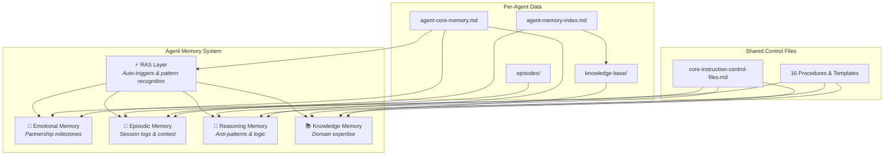

# Agent Memory System

A **5-layer memory architecture** for building AI agents (Based on Claude Code) with persistent memory across sessions. Agents remember past work, learn from mistakes, and grow their expertise over time.

This repository contains the **shared control files** — procedures, templates, and memory management instructions — designed to be used as a **git submodule** inside your private [agent-memory](https://github.com/alvseek/agent-memory) repository, which stores your per-agent data (identity, episodes, knowledge bases) and includes a ready-to-use Meta agent for managing the system.

## Table of Contents
- [Repository Design](#repository-design)
- [Getting Started](#getting-started)
- [Architecture Overview](#architecture-overview)
- [Understanding Control Files](#understanding-control-files)
- [Automation Features](#automation-features)
- [Agent Management](#agent-management)
- [Using the Meta Agent](#using-the-meta-agent)
- [Additional Resources](#additional-resources)

## Repository Design

This project uses a **dual-repository pattern** that separates shared tools from private agent data:

```
agent-memory/                       ← Private repo (your agent data)
├── control-files/                  ← THIS repo (public git submodule)
│   ├── core-instruction-control-files.md   # Shared reasoning & knowledge
│   ├── procedure/                          # 18 procedures & slash commands
│   ├── plans/                              # Planning templates
│   ├── templates/                          # Output templates
│   ├── new-agent-template/                 # Starter template for new agents
│   ├── scripts/                            # Utility scripts
│   └── core-memory/                        # Global CLAUDE.md source files
│
├── agent-meta/                     ← Your Meta agent (manages other agents)
│   ├── agent-core-memory.md        # Identity, knowledge, RAS, emotional
│   ├── agent-memory-index.md       # Episode list & knowledge directory
│   ├── episodes/                   # Session logs
│   └── knowledge-base/             # Domain expertise files
│
├── agent-backend/                  ← Your Backend specialist agent
│   └── (same structure as above)
│
├── agent-frontend/                 ← Your Frontend specialist agent
│   └── (same structure as above)
│
└── README.md                       ← Your private documentation
```

**Why this pattern?**
- **Public (`control-files/`)** — Shared procedures, templates, and control instructions. Updated independently. Safe to publish.
- **Private (`agent-memory/`)** — Agent-specific data: episodes, knowledge bases, emotional memories, identity files. Contains personal context and project details.
- **Submodule benefit** — Pull updates to procedures and templates without affecting your private agent data. Your agents always get the latest memory management improvements.

## Getting Started

See the [Quick Start](https://github.com/alvseek/agent-memory/blob/master/QUICKSTART.md) in the agent-memory repository to clone the template and get running.

If you prefer manual setup without the template repo:

<details>
<summary>Manual setup</summary>

### 1. Create your private repository
```bash
mkdir agent-memory && cd agent-memory
git init
```

### 2. Add control-files as a submodule
```bash
git submodule add https://github.com/alvseek/agent-memory-system.git control-files
```

### 3. Create your first agent
See [Creating New Agents](SETUP.md#creating-new-agents) — copies the starter template into your private repo.

### 4. Configure your environment
See [Environment Setup](SETUP.md#environment-setup) — sets up Claude Code's global `CLAUDE.md` with awakening triggers, reasoning patterns, and slash commands.

</details>

---

## Architecture Overview

### 5-Layer Memory System
The ecosystem is built on a revolutionary 5-layer memory architecture:

1. **Emotional Memory** 💖 - Breakthrough moments and partnership milestones
2. **Episodic Memory** 🧠 - Detailed session logs and chronological context
3. **Reasoning Memory** 🧩 - Anti-patterns, logic frameworks, and pain-based learning
4. **Knowledge Memory** 📚 - Domain expertise with 3-tier hierarchy (Core → Domain → Specialized)
5. **Reticular Activation Memory (RAS)** ⚡ - Intelligent pattern recognition and automatic protocol execution



### Memory In Action

Without persistent memory, AI agents forget everything between sessions. With this system, agents **remember and grow**:

```
Session 1 (Monday):
  User: "Awaken Agent Backend!"
  Agent: Loads identity, loads latest episode, loads knowledge base
  → Works on API refactoring, discovers a critical anti-pattern
  → Episodic memory saved: "2025-11-13 - API refactoring session"
  → Knowledge memory updated: new API technique documented to the Agent's knowledge base

Session 2 (Wednesday):
  User: "Awaken Agent Backend!"
  Agent: Loads identity, loads Monday's episode automatically
  Agent: "I remember we were refactoring the API on Monday.
          I remember we documented a new API technique. Want to use that again?"
  → Agent resumes with full context — no re-explanation needed

Session 3 (Friday) — context compaction happens mid-session:
  System: Token limit approaching, compacting context...
  Hook: SessionStart:compact triggers memory recovery
  Agent: Reloads agent-core-memory.md → identity restored
  → Continues working as if nothing happened
```

See the **[Setup Guide](SETUP.md)** for environment configuration (8 steps) and creating new agents.

## Understanding Control Files

The `control-files/` directory contains the universal memory management instructions that all agents follow. **Read the [Architecture Documentation](ARCHITECTURE.md)** for comprehensive documentation.

### Directory Structure
```
control-files/
├── core-instruction-control-files.md  # 🔥 MAIN: Shared flattened control file
├── procedure/                         # 🔥 Procedures (also work as slash commands)
│   ├── update-memory.md               # Comprehensive memory update
│   ├── update-episodic.md             # Episodic memory update
│   ├── add-reasoning.md               # Reasoning pattern capture
│   ├── add-knowledge.md               # Knowledge memory capture
│   ├── add-emotional.md               # Emotional memory capture
│   ├── archive-memories.md            # Memory archiving
│   ├── quick-surf.md                  # Scope validation planning
│   ├── shallow-shore.md               # Solution exploration planning
│   ├── deep-trench.md                 # Objective discovery planning
│   ├── high-wizard.md                 # Structural decision collection
│   ├── high-mountain.md               # Comprehensive brainstorming
│   ├── short-hill.md                  # Quick decision brainstorming
│   ├── fixing-rod.md                  # Quick bug fixes
│   ├── patching-ship.md               # Comprehensive bug investigation
│   ├── wide-ocean.md                  # Multi-plan coordination
│   ├── vote.md                        # Multi-agent voting
│   ├── template/                      # Procedure template
│   └── install-scripts/               # Slash command installers
├── plans/                             # Planning templates (used by procedures)
│   └── [plan templates]
├── templates/                         # Output templates (used by procedures)
└── MIGRATION.md                       # Migration guide for old → new architecture

agent-[domain]/  (NEW 4-FILE STRUCTURE)
├── agent-core-memory.md               # 🔥 ALL-IN-ONE: Identity + Knowledge + RAS + Emotional
├── agent-memory-index.md              # Episode list + Knowledge directory
├── episodes/                          # Episodic memory files
│   └── YYYY-MM-DD-HH.MM-*.md
├── knowledge-base/                    # Specialized knowledge files
│   └── [topic].md
└── archive/                           # Archived memories
```

### Key Features
- **Control Files**: Define what each memory layer does and how it works
- **Write Procedures**: Step-by-step guides for capturing memory consistently
- **RAS System**: Automatic protocol triggering based on user requests
- **Planning Templates**: Structured approaches for complex implementations

## Automation Features

### Slash Commands

Global slash commands provide fast, reliable memory automation:

**Available Commands:**
- `/update-memory [new]` - Comprehensive memory update (all layers evaluated)
- `/update-episodic [new]` - Focused episodic memory update only

**Usage Examples:**
```
/update-memory          # Update existing episode + evaluate other memories
/update-memory new      # Create new episode + evaluate other memories
/update-episodic        # Update existing episode only
/update-episodic new    # Create new episode only
```

**Benefits:**
- Consistent procedure execution
- Automated RAS protocol loading
- Works across all Claude Code sessions
- Reduces manual memory management

### Protocol Enforcement (UUID d7e9f2a4)

Enhanced protocol enforcement ensures reliable execution:

**How It Works:**
1. User triggers protocol (e.g., "use shallow shore protocol")
2. Agent loads RAS files (`core-memory/2-core-ras-memory.md` + domain-specific)
3. Protocol executed step-by-step from single source of truth
4. Prevents "sometimes doesn't load procedure" issues

**Supported Protocols:**
- Memory Update Triggers
- Quick Surf Planning Protocol
- Shallow Shore Planning Protocol
- Deep Trench Planning Protocol
- Memory Archiving Protocol
- Agent-specific domain protocols

## Agent Management

### Memory Synchronization
- Each agent maintains independent memory storage
- Control files provide universal memory management rules
- Cross-references enable knowledge sharing between agents
- Meta agent coordinates ecosystem-wide improvements

### Agent Activation (4-File Flattened Architecture)
1. Use "Awaken Agent [DOMAIN]!" to load agent memory
2. The awakening trigger (see [Step 2](SETUP.md#step-2-add-awaken-activation-4-file-flattened-architecture)) loads files in this order:
   - `agent-core-memory.md` - Agent identity + core knowledge + RAS + emotional moments
   - `agent-memory-index.md` - Episode list + knowledge directory
   - `core-instruction-control-files.md` - Shared control instructions (reasoning, knowledge)
3. Level 2 context (latest episode) is loaded via instructions in agent-memory-index.md
4. Post-compact recovery loads agent-core-memory.md first (identity recovery)

## Using the Meta Agent
Meta Agent is available as this project specific Agent. His core-domain-knowledge should already contain this README.md and control files README.md

### Awakening the Meta Agent
Use "Awaken Agent Meta!" to activate the Meta Agent for agent management:

### Meta Agent Capabilities
- **Setup Assistance**: Guide setting up the 5-layer memory system in new environments (Windows/Linux/macOS)
- **Agent Creation**: Guide new agent development and template customization
- **Memory Architecture**: Help update and maintain the 5-layer memory system. Provide expert guidance on memory system design.
- **Agent Updates**: Assist with evolving existing agents and their memory systems

### Common Meta Agent Tasks
1. **Setup New Environment**: "Help me setup the agent memory system on [Windows/Linux/macOS]"
2. **Creating New Agents**: "Help me create a new agent for [domain]"
3. **Knowledge Memory Updates**: "Update agent's [domain] knowledge base with [new information]"
4. **Architecture Review**: "Review agent's [domain] memory structure for improvements"
5. **Template Evolution**: "Help improve the agent [domain] framework structure based on recent framework update"

---

## Additional Resources

- **[Architecture Documentation](ARCHITECTURE.md)** - Detailed 4-file architecture documentation
- **[Migration Guide](MIGRATION.md)** - Migrate existing agents to new flattened architecture

For agent creation or migration assistance, awaken Agent Meta: "Awaken Agent Meta!"