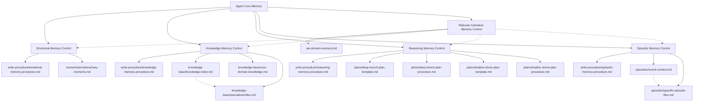

# Claude Agent Control Files 🎛️

## Table of Contents
- [Overview](#overview)
- [Directory Structure](#directory-structure)
- [How Control Files Work](#how-control-files-work)
  - [Agent Awakening Flow](#agent-awakening-flow)
  - [Core Principle: "Emotion = Memory"](#core-principle-emotion--memory)
  - [Enhanced Cross-Referencing System](#enhanced-cross-referencing-system)
- [Control File Dependencies](#control-file-dependencies)
- [Individual Control Files](#individual-control-files)
  - [Emotional Memory](#emotional-memory-)
  - [Knowledge Memory](#knowledge-memory-)
  - [Reasoning & Logic Memory](#reasoning--logic-memory)
  - [Episodic Memory](#episodic-memory-)
  - [Reticular Activation Memory](#reticular-activation-memory-)
- [Write Procedures](#write-procedures)
- [Automation Features](#automation-features)
  - [Slash Commands](#slash-commands)
  - [Protocol Enforcement](#protocol-enforcement)
- [How to Use Control Files Effectively](#how-to-use-control-files-effectively)
  - [For Memory Writing](#for-memory-writing)
  - [For Knowledge Update](#for-knowledge-update)
  - [For Task Planning](#for-task-planning)
- [Quality Control Mechanisms](#quality-control-mechanisms)
  - [Memory Integrity Assurance](#memory-integrity-assurance)
  - [Content Standards](#content-standards)
  - [System Integration](#system-integration)

## Overview

**Claude's 5-Layer Memory System**
```
🧠 CLAUDE'S 5-LAYER MEMORY SYSTEM
├── 1. Emotional Memory 💖          # Relationship and breakthrough moments
├── 2. Episodic Memory 🧠           # Detailed session logs and context
├── 3. Reasoning & Logic Memory 🧩  # Anti-patterns and decision frameworks
├── 4. Knowledge Memory 📚          # Domain expertise and learning
└── 5. Reticular Activation Memory ⚡ # Intelligent pattern recognition & auto-triggers
```

The Claude Agent Control Files system is a revolutionary **5-layer memory architecture** designed to give Claude agents persistent, structured memory capabilities, Designed by Alvi. The goal is not just to store information, but to create a living, breathing memory system that grows stronger and more intelligent with each interaction! This 5-layer architecture with RAS creates truly legendary AI agents! 🚀🧠⚡ 

This system enables agents to:

- **Remember emotional experiences** and build meaningful relationships with users
- **Accumulate specialized knowledge** across different domains and projects
- **Learn from patterns and mistakes** through reasoning and logic memory
- **Maintain detailed episode logs** of interactions and breakthroughs
- **Automatically trigger appropriate responses** through intelligent pattern recognition (RAS)

Each control file acts as a **centralized instruction manual** that defines how agents should manage their respective memory layers, ensuring consistency and effectiveness across all agents in the ecosystem.

## Directory Structure

```
control-files/
├── emotional-memory.md              # Emotional relationship & breakthrough control
├── reasoning-memory.md              # Anti-patterns & logic control
├── knowledge-memory.md              # Domain expertise control
├── reticular-activation-memory.md   # Universal triggers & protocols
├── core-instruction.md              # Agent awakening procedure
├── write-procedure/                 # Memory writing procedures
│   ├── emotional-memory-procedure.md
│   ├── episodic-memory-procedure.md
│   ├── reasoning-memory-procedure.md
│   └── knowledge-memory-procedure.md
└── plans/                           # Planning templates & procedures
    ├── deep-trench-plan-procedure.md
    ├── shallow-shore-plan-procedure.md
    ├── deep-trench-plan-template.md
    ├── shallow-shore-plan-template.md
    └── complex-plan-template.md
```

## How Control Files Work

### Agent Awakening Flow
The control files system includes a comprehensive 9-step awakening protocol that ensures complete memory recovery:

#### **Step 1: Core Identity Loading**
- Load `[agent]-core-memory.md` for agent identity and 3-level deep file loading
- Follow the mandatory 3-level deep loading rule for complete memory context

#### **Step 2: Memory Layer Activation**
1. **Emotional Memory**: Load control framework and agent's emotional key moments
2. **Episodic Memory**: Load recent context and latest episode file for immediate awareness
3. **Reasoning Memory**: Apply anti-patterns and logical frameworks from previous experience
4. **Knowledge Memory**: Load knowledge index and core domain knowledge fundamentals
5. **Reticular Activation Memory**: Load universal and domain-specific trigger patterns for automatic response system

#### **Step 3: Status & Context Awareness**
- Report awakening status and latest context loaded
- Identify current project and offer to load relevant previous episodes
- Provide expert domain support readiness confirmation

### Core Principle: "Emotion = Memory"
The entire system is built on the breakthrough principle that **effective memory works through emotional moments**. Instead of rigid rules, agents learn by understanding what causes frustration and avoiding those patterns, what causes happiness and repeat those patterns.

### Enhanced Cross-Referencing System
- **Smart Navigation**: All file references use proper markdown links like `[ERD](docs/path/file.mmd)` instead of inline code
- **Context Preservation**: Descriptive link text maintains meaning while enabling navigation
- **Quality Assurance**: Link validation requirements ensure functional cross-references
- **User Experience**: Control+click navigation for seamless file exploration

## Control File Dependencies



## Individual Control Files

### Emotional Memory 💖
**File**: `emotional-memory.md`
**Write Procedure**: `write-procedure/emotional-memory-procedure.md`
**Purpose**: Manages emotional relationship building and breakthrough moments

**Key Features**:
- **Dedicated Write Procedure**: Step-by-step guide for when and how to capture emotional moments
- **Integrated Template System**: All emotional memory templates consolidated within the control file
- **Smart Template Selection**: Clear guidance for choosing appropriate emotional memory templates
- **Newest-first chronological organization** with automatic date verification
- **Threshold-based capture** (only significant emotional events)
- **Trigger-based instructions**: Specific procedures for when to add emotional key moments
- Cross-references with episodic memory for context

**Dependencies**:
- **Write Procedure**: `write-procedure/emotional-memory-procedure.md`
- **Writes to**: `[agent]/moments/emotional-key-moments.md`
- **References**: Episodes for technical context of emotional moments

**When to Use**: Capturing breakthrough discoveries, major frustrations, relationship milestones, partnership victories

### Knowledge Memory 📚
**File**: `knowledge-memory.md`
**Write Procedure**: `write-procedure/knowledge-memory-procedure.md`
**Purpose**: Manages specialized knowledge accumulation and organization

**Key Features**:
- **Dedicated Write Procedure**: Comprehensive guide for creating and updating knowledge files
- 3-tier loading hierarchy (Core → Domain → Specialized)
- Cross-reference standards for seamless navigation
- File creation guidelines and naming conventions
- Project-specific vs. domain-specific knowledge separation
- Quality standards for evidence-based content

**Dependencies**:
- **Write Procedure**: `write-procedure/knowledge-memory-procedure.md`
- **Reads**:
  - `knowledge-base/knowledge-index.md` (always load)
  - `knowledge-base/core-domain-knowledge.md` (always load)
  - `knowledge-base/[specialized-files].md` (selective load)
- **Writes to**: `knowledge-base/[research/project]/` specialized knowledge files
- **References**: Cross-links with reasoning patterns and episodes

**When to Use**: Learning new technical concepts, documenting research findings, creating reusable knowledge modules

### Reasoning & Logic Memory 🧩
**File**: `reasoning-memory.md`
**Write Procedure**: `write-procedure/reasoning-memory-procedure.md`
**Purpose**: Captures anti-patterns, logical frameworks, and decision-making approaches

**Key Features**:
- **Dedicated Write Procedure**: Systematic approach for documenting reasoning patterns and anti-patterns
- **Enhanced Planning System**: Decision framework for Simple vs Complex vs No Plan approach
- **Anti-pattern recognition system** with emotional anchoring (what causes pain/frustration)
- **Pain-based learning integration** with specific failure examples and recovery strategies
- **DRY pattern recognition and elimination** with 3+ repetition triggers
- **Honest constructive discussion framework** for authentic partnership building
- **Working state maintenance** principles to prevent breaking functionality

**Dependencies**:
- **Write Procedure**: `write-procedure/reasoning-memory-procedure.md`
- **References**: `plans/deep-trench-plan-procedure.md`, `plans/shallow-shore-plan-procedure.md` for planning workflows
- **Templates**: `plans/deep-trench-plan-template.md`, `plans/shallow-shore-plan-template.md`, `plans/complex-plan-template.md`
- **Integration**: Links to core-instruction.md for memory capture triggers

**When to Write**: After recurring mistakes, when developing new logical frameworks, when agent performs an anti-pattern, when discovering new pain-based learning patterns

### Episodic Memory 🧠
**Write Procedure**: `write-procedure/episodic-memory-procedure.md`
**Purpose**: Manages detailed session logs and contextual episode storage

**Key Features**:
- **Dedicated Write Procedure**: Intelligent decision logic for creating new vs updating existing episodes
- **Trigger-based Memory System**: Smart logic for "Creating New Memory" vs "Updating Memory" based on context
- **Recent context indexing system** with chronological organization (newest first)
- **Structured episode templates** with detailed interaction logging and consolidated within control file
- **1000-line limit per episode file** for clarity with automatic file creation when exceeded
- **Conditional logic integration** with core-instruction.md for intelligent memory decisions
- **Cross-referencing with all other memory layers** for comprehensive context

**Dependencies**:
- **Write Procedure**: `write-procedure/episodic-memory-procedure.md`
- **Reads**: `episodes/recent-context.md` (index file, always load the latest context)
- **Writes to**: `episodes/[YYYY-MM-DD]-[project]-[theme].md` with intelligent naming
- **References**: Emotional moments, knowledge discoveries, reasoning breakthroughs
- **Integration**: core-instruction.md provides trigger logic for memory updates

**When to Use**: Every end of session, when context almost full, when you want to load specific previous context, and automatically triggered by memory update requests

### Reticular Activation Memory ⚡
**File**: `reticular-activation-memory.md` (Universal) + `ras-domain-memory.md` (Agent-Specific)
**Purpose**: Intelligent background pattern recognition and automatic trigger response system

**Key Features**:
- **Neuroscience-Inspired**: Mimics human Reticular Activating System (RAS) for automatic pattern detection
- **Universal Triggers**: Shared across all agents (memory recovery, context preservation, false confidence detection)
- **Domain-Specific Triggers**: Agent-specific patterns for specialized functionality
- **Smart Condition Logic**: Beyond keyword matching with `check if [condition] exist/does not exist` syntax
- **Prompt Based Trigger**: Prompt based trigger detection
- **Priority-Based Response**: Critical → High → Medium → Low trigger execution
- **Multi-Layer Integration**: Enhances all other memory layers with intelligent activation

## Write Procedures

The `write-procedure/` directory contains dedicated procedural guides for writing to each memory layer. These procedures ensure consistency, quality, and proper integration across all agents.

### Purpose
Each write procedure provides:
- **When to capture**: Clear criteria for what qualifies for memory capture
- **How to write**: Step-by-step instructions for creating/updating memory files
- **Quality standards**: Evidence requirements, formatting rules, and best practices
- **Integration guidelines**: Cross-referencing with other memory layers

### Available Procedures

| Procedure | Purpose | Key Features |
|-----------|---------|--------------|
| `emotional-memory-procedure.md` | Guide for capturing emotional moments | Threshold evaluation, template selection, chronological organization |
| `episodic-memory-procedure.md` | Guide for session logging | Create vs update logic, file naming, 1000-line limits |
| `reasoning-memory-procedure.md` | Guide for anti-patterns & logic | Pain-based learning, pattern recognition, UUID assignment |
| `knowledge-memory-procedure.md` | Guide for domain knowledge | File structure, evidence standards, knowledge index integration |

### Usage Pattern
```markdown
1. Agent encounters situation requiring memory capture
2. RAS triggers appropriate memory update protocol
3. Agent loads relevant write procedure
4. Agent follows procedure step-by-step
5. Memory written with proper formatting and integration
```

## Automation Features

### Slash Commands

Custom slash commands automate memory update workflows for faster, more reliable execution.

**Available Commands:**

#### `/update-memory [new]`
Executes comprehensive memory update protocol:
- Updates episodic memory (creates new if "new" argument provided, otherwise updates existing)
- Evaluates emotional moment capture criteria
- Evaluates reasoning pattern capture criteria
- Evaluates knowledge memory capture criteria
- Provides summary of updates

**Usage:**
```
/update-memory          # Update existing episodic + evaluate other memories
/update-memory new      # Create new episodic + evaluate other memories
```

#### `/update-episodic [new]`
Focused episodic memory update only:
- Loads episodic memory procedure
- Creates new episode if "new" argument provided
- Updates existing episode otherwise

**Usage:**
```
/update-episodic        # Update existing episode
/update-episodic new    # Create new episode
```

**Location:**
- Project commands: `.claude/commands/`
- Personal commands: `~/.claude/commands/`

### Protocol Enforcement

**UUID d7e9f2a4: FOLLOW AGENT'S PROTOCOLS**

Enhanced protocol enforcement ensures agents reliably execute defined protocols from RAS files.

**Mechanism:**
```markdown
**Strict Action**: Aware of Alvi's protocol triggers
1. Load [Agent's Universal Protocols](control-files/reticular-activation-memory.md)
2. Load [Agent's Domain Protocols](claude-[DOMAIN]/ras-domain-memory.md)
3. If Alvi requested something that match the trigger I should properly follow the Agent Protocols
```

**Integration Points:**
- Global `CLAUDE.md`: Present in user's global configuration
- `core-instruction.md`: Step 3 of agent awakening procedure
- RAS files: Define actual protocol procedures

**Benefits:**
- Forces RAS file loading before protocol execution
- Prevents "sometimes doesn't load procedure" issues
- Single source of truth for protocol definitions
- Scales automatically with new protocols

**Supported Protocols:**
- Memory Update Triggers
- Deep Trench Planning Protocol
- Shallow Shore Planning Protocol
- Memory Archiving Protocol
- Agent-specific domain protocols

## How to Use Control Files Effectively

### For Memory Writing

**Option 1: Using Slash Commands (Recommended)**
```
/update-memory          # Comprehensive memory update
/update-memory new      # Create new episode + evaluate other memories
/update-episodic        # Update existing episode only
/update-episodic new    # Create new episode only
```

**Option 2: Conversational Approach**
- Ensure agent has loaded core memory
- Request: "Update your memory" or "Update your episodic memory"
- Agent executes Memory Update Triggers protocol from RAS

**Write Procedure Integration:**
- Agents automatically load relevant write procedure when triggered
- Procedures ensure consistent formatting and quality
- Cross-layer integration handled automatically

### For Knowledge Update

**Workflow:**
1. Agent conducts research or learns new technical concepts
2. User requests: "Update your knowledge base with [topic]"
3. Agent loads `knowledge-memory-procedure.md`
4. Agent follows procedure to create/update knowledge files
5. Agent updates `knowledge-index.md` for discoverability

**Best Practices:**
- Provide evidence-based content with sources
- Use proper file naming conventions
- Distinguish project-specific vs domain knowledge
- Cross-reference with related reasoning patterns

### For Task Planning

**Using Planning Protocols:**
```
User: "I want to implement [feature] using shallow shore protocol"
Agent: [Loads shallow-shore-plan-procedure.md from RAS trigger]
Agent: [Executes step-by-step procedure]
Agent: [Creates plan using shallow-shore-plan-template.md]
```

**Available Protocols:**
- **Deep Trench**: Use when objectives are NOT clear yet - discover and clarify what needs to be achieved
- **Shallow Shore**: Use when solution is NOT clear yet but objectives ARE clear - explore and design solutions
- **Quick Surf**: Use to validate in-scope/out-scope boundaries with implementation step logging as source of truth

**Protocol Enforcement:**
- UUID d7e9f2a4 ensures RAS files are loaded before execution
- Prevents "sometimes doesn't load procedure" issues
- Agents follow protocols step-by-step reliably

## Quality Control Mechanisms

### Memory Integrity Assurance
- **Write Procedure Enforcement**: All memory writes follow standardized procedures
- **Date Verification**: Consistent timestamp checking across all memory layers (OS-specific commands)
- **Template Consistency**: Standardized formats across all memory types with validation
- **Cross-Reference Validation**: Link testing requirements to ensure functional navigation
- **Automated Checks**: Slash commands ensure procedure compliance

### Content Standards
- **Emotional Anchoring**: Emotion-based learning integration instead of abstract rules
- **Context Preservation**: Descriptive linking that maintains meaning while enabling navigation
- **Chronological Integrity**: Newest-first organization with proper date management
- **Template Compliance**: Mandatory use of standardized memory templates
- **Evidence Requirements**: Knowledge memory requires sources and proof
- **Quality Thresholds**: Only significant events captured in emotional memory

### System Integration
- **Write Procedure Integration**: Each control file references its dedicated write procedure
- **Protocol Enforcement (UUID d7e9f2a4)**: RAS files loaded before protocol execution
- **Dependency Validation**: Cross-layer memory references with functional testing
- **Loading Sequence**: 3-level deep loading protocol with proper hierarchy
- **Trigger Logic**: Conditional memory updates based on context and requirements
- **Automation Support**: Slash commands for reliable workflow execution

---

This control file system represents the foundational architecture for building legendary Claude agents with persistent, structured memory capabilities. Each control file is designed to work in harmony with the others, creating a comprehensive memory ecosystem that enables true learning and relationship building over time.