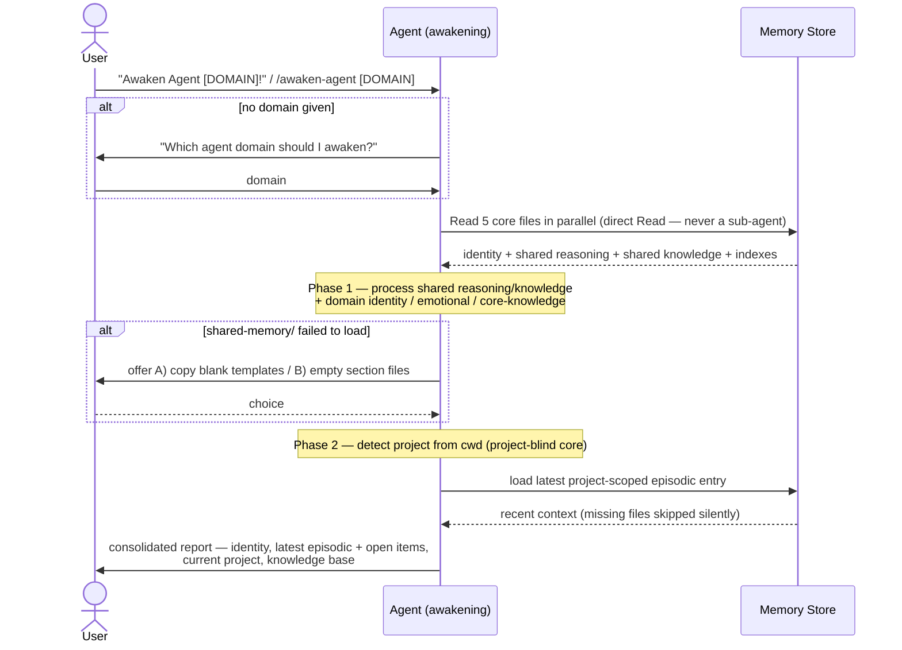

# Flow: Awaken Agent

**Trigger**: User says **"Awaken Agent [DOMAIN]!"** (the global `CLAUDE.md` RAM trigger, UUID `f9d2c8b7-…`) or invokes the **`/awaken-agent [domain]`** slash command.
**Type**: `sequenceDiagram` — the awakening is a multi-participant interaction over time (user → agent → memory store → report), so a sequence fits better than a flowchart or state diagram.
**Participants**: User · Agent (the awakening agent) · Memory Store (the 5 core files + project episodic).

> **Scope**: this is the **memory-core** awakening — **project-blind**. It loads identity + shared foundations + the latest project-scoped episodic, and reports. A **coding agent** composes the overlay **`/awaken-coder`** on top, which adds project context, the orientation map, the fleet roster, and the task-system hook (those are overlay concerns, not shown here).

---

## Diagram

## Steps

1. **Trigger** — user fires `Awaken Agent [DOMAIN]!` or `/awaken-agent [domain]`. If no domain is given, the agent asks for one ([awaken-agent.md](../../procedures/awaken-agent.md) Arguments).
2. **Load 4 memory files** — the agent reads all four **in parallel, via the Read tool directly** (never a sub-agent — sub-agent summaries produce a hollow awakening): `agent-[DOMAIN]/agent-core-memory.md`, `agent-[DOMAIN]/agent-memory-index.md`, `shared-memory/core-reasoning-memory.md`, `shared-memory/core-knowledge-memory.md` ([awaken-agent.md](../../procedures/awaken-agent.md) Step 1). The awakening protocol is not among them — it is inlined into the command itself.
3. **Phase 1 — process loaded identity** — process shared reasoning + shared knowledge, then the user profile + domain identity / emotional / core-knowledge ([core-instruction-control-files.md](../../procedures/components/core-instruction-control-files.md) Phase 1). If `shared-memory/` failed to load, offer the A/B fallback.
4. **Phase 2 — load recent context (project-blind)** — detect the project from cwd and load the latest project-scoped episodic entry (fallback to absolute-latest, flagged non-project-specific). The core does **not** load project context or the fleet roster — those are the coding overlay's job.
5. **Report** — emit one consolidated status block: identity, latest episodic + carried-forward open items, current project, knowledge base.

## Preconditions & Notes

- **Preconditions**: `[AGENT-MEMORY-PATH]` is configured; `agent-[DOMAIN]/` exists for the requested domain.
- **Critical branch — direct read, not sub-agent**: Step 1 must use the Read tool in the agent's own context. Delegating to a sub-agent returns summaries → diluted identity + missing reasoning patterns.
- **Branches / errors**: no domain → ask; `shared-memory/` missing → A) copy blank templates / B) empty section files; project not detected → fall back to absolute-latest episodic (flagged non-project-specific).
- **Coding-overlay extension**: a coding agent runs **`/awaken-coder`**, which invokes this core awakening and then adds project context (shared + private), the orientation map (`/map-orientation`), the fleet roster (`fleet-agents.md`), and the task-system hook (Todoist / Jira).
- **External dependencies**: the 5 core memory files + per-project episodic index.
- **Post-compaction variant**: the same 5-file load is re-run on a session-continuation summary (the MEMORY RECOVERY AFTER COMPACTION trigger, UUID `176b0df7`).

## Related

- [awaken-agent.md](../../procedures/awaken-agent.md) — the dispatcher procedure
- [core-instruction-control-files.md](../../procedures/components/core-instruction-control-files.md) — the Phase 1 / Phase 2 awakening instructions (a component, inlined into the command)
- [ADR-003: Four-File Flattened Architecture](../../../docs/adr/2025-11-28-four-file-flattened-architecture.md) — why awakening loads a flattened file set
