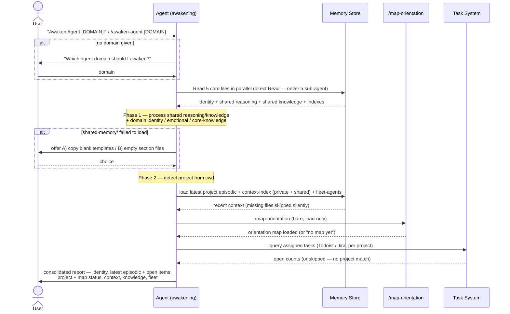

# Flow: Awaken Agent

**Trigger**: User says **"Awaken Agent [DOMAIN]!"** (the global `CLAUDE.md` RAM trigger, UUID `f9d2c8b7-…`) or invokes the **`/awaken-agent [domain]`** slash command.
**Type**: `sequenceDiagram` — the awakening is a multi-participant interaction over time (user → agent → memory store → map → task system → report), so a sequence fits better than a flowchart or state diagram.
**Participants**: User · Agent (the awakening agent) · Memory Store (the 5 core files + project episodic/context) · `/map-orientation` · Task System (Todoist / Jira, per project).

---

## Diagram

## Steps

1. **Trigger** — user fires `Awaken Agent [DOMAIN]!` or `/awaken-agent [domain]`. If no domain is given, the agent asks for one ([awaken-agent.md](../../procedures/awaken-agent.md) Arguments).
2. **Load 5 core files** — the agent reads all five **in parallel, via the Read tool directly** (never a sub-agent — sub-agent summaries produce a hollow awakening): `core-instruction-control-files.md`, `agent-[DOMAIN]/agent-core-memory.md`, `agent-[DOMAIN]/agent-memory-index.md`, `shared-memory/core-reasoning-memory.md`, `shared-memory/core-knowledge-memory.md` ([awaken-agent.md](../../procedures/awaken-agent.md) Step 1).
3. **Phase 1 — process loaded identity** — process shared reasoning + shared knowledge, then the user profile + domain identity / emotional / core-knowledge ([core-instruction-control-files.md](../../core-instruction-control-files.md) Phase 1). If `shared-memory/` failed to load, offer the A/B fallback.
4. **Phase 2 — load project context** — detect the project from cwd, load the latest project-scoped episodic + context-index (private + shared) + `fleet-agents.md`, call `/map-orientation` (bare, load-only), and run the project's task-system hook (Todoist / Jira).
5. **Report** — emit one consolidated status block: identity, latest episodic + carried-forward open items, project + orientation-map status, project context, knowledge base, fleet.

## Preconditions & Notes

- **Preconditions**: `[AGENT-MEMORY-PATH]` is configured; `agent-[DOMAIN]/` exists for the requested domain.
- **Critical branch — direct read, not sub-agent**: Step 1 must use the Read tool in the agent's own context. Delegating to a sub-agent returns summaries → diluted identity + missing reasoning patterns.
- **Branches / errors**: no domain → ask; `shared-memory/` missing → A) copy blank templates / B) empty section files; project not detected → fall back to absolute-latest episodic (flagged non-project-specific); no task-system match → skip silently.
- **External dependencies**: the 5 core memory files, per-project episodic + context indexes, `fleet-agents.md`, `/map-orientation`, and the task-system integrations (Todoist / Jira).
- **Post-compaction variant**: the same 5-file load is re-run on a session-continuation summary (the MEMORY RECOVERY AFTER COMPACTION trigger, UUID `176b0df7`).

## Related

- [awaken-agent.md](../../procedures/awaken-agent.md) — the dispatcher procedure
- [core-instruction-control-files.md](../../core-instruction-control-files.md) — the Phase 1 / Phase 2 awakening instructions
- [map-orientation.md](../../procedures/map-orientation.md) — the orientation-map load called in Phase 2
- [ADR-003: Four-File Flattened Architecture](../../../docs/adr/2025-11-28-four-file-flattened-architecture.md) — why awakening loads a flattened file set
