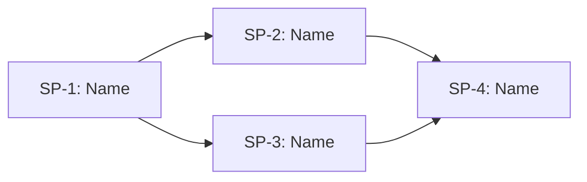

# Council of Wizards Plan

## **FEATURE INFO**
- **Project**: [Project Name]
- **Date**: [YYYY-MM-DD]
- **Agent**: [Agent Name]
- **Feature**: [Brief description of the feature being delivered]
- **Source Protocol**: `/council-of-wizards` — [Procedure](//@agent-memory/control-files/procedures/council-of-wizards.md)

*CRITICAL INSTRUCTION: To continue this plan: load the source protocol above, then inspect which sections below are filled vs unfilled to infer your current step.*

---

## **REQUIREMENTS BREAKDOWN**
*Filled AFTER [USER-NAME] confirms the WAIT Options (Step 6). This table is the formal record of confirmed requirements that informs the scope gate and sub-plan decomposition.*

| # | Requirement | Description |
|---|-------------|-------------|
| R1 | [Requirement name] | [What needs to be built/changed] |
| R2 | [Requirement name] | [What needs to be built/changed] |
| R3 | [Requirement name] | [What needs to be built/changed] |

---

## **SCOPE GATE**
*Evaluate whether this feature truly needs multi-plan orchestration (council) or can be handled by a single `/high-wizard`.*

**Criteria** — council is needed when ANY of these are true:
- [ ] Feature has **independently shippable sub-deliverables** that build on each other
- [ ] Feature requires **integration contracts** between parts (one plan produces what another consumes)
- [ ] Scope is **too large for a single `/high-wizard`** to cover without losing detail

**Assessment**: [Explain why this feature meets/doesn't meet the criteria above]

**Decision**: [ ] Proceed with Council | [ ] De-escalate to `/high-wizard`

*If de-escalating: delete this file, launch `/high-wizard` with the requirements already gathered above.*

---

## **CONFIRMED DECISIONS**
*These decisions were collected during decomposition investigation and confirmed by [USER-NAME]. The reasons serve as the analysis record for why the feature was decomposed this way.*

| # | Decision | Chosen | Reason |
|---|----------|--------|--------|
| 1 | [Decision topic] | [Chosen option] | [Evidence-based reason] |
| 2 | [Decision topic] | [Chosen option] | [Evidence-based reason] |

---

## **SUB-PLANS TABLE**
*Single canonical table — all other sections reference sub-plans by their ID. Do NOT duplicate this table elsewhere.*

| ID | Sub-Plan Name | Description | Requirements | Protocol | Plan File | Status |
|----|--------------|-------------|--------------|----------|-----------|--------|
| SP-1 | [Name] | [What this sub-plan delivers] | R1, R2 | HW / QW | `SP-1-[name].md` | NOT STARTED |
| SP-2 | [Name] | [What this sub-plan delivers] | R3 | HW / QW | `SP-2-[name].md` | NOT STARTED |
| SP-3 | [Name] | [What this sub-plan delivers] | R4, R5 | HW / QW | `SP-3-[name].md` | NOT STARTED |

**How to fill**: Each sub-plan groups related requirements into a coherent deliverable. Protocol column indicates whether to use `/high-wizard` (complex) or `/quick-wizard` (simple). Plan File links to the actual sub-plan file once created. Status tracks: NOT STARTED → IN PROGRESS → DONE.

---

## **INTEGRATION CONTRACTS**
*References to separate YAML contract files that define the interfaces between sub-plans. Use industry-standard formats (OpenAPI, AsyncAPI, JSON Schema).*

| Contract ID | Between | Format | File Path | Verified |
|------------|---------|--------|-----------|----------|
| C-1 | SP-1 ↔ SP-2 | [OpenAPI / AsyncAPI / JSON Schema / other] | `contracts/[contract-name].yaml` | [ ] |
| C-2 | SP-2 ↔ SP-3 | [OpenAPI / AsyncAPI / JSON Schema / other] | `contracts/[contract-name].yaml` | [ ] |

**How to fill**: Identify what data/interfaces flow between sub-plans. Create a YAML contract file for each integration point using the appropriate industry standard. File paths are relative to this plan's folder. The "Verified" column is checked during Feature Completion when both sides of the contract are confirmed working.

*If no integration contracts are needed (sub-plans are independent), write "None — sub-plans have no integration dependencies" and remove the table.*

---

## **DEPENDENCY GRAPH**
*Mermaid diagram showing sub-plan relationships. Identifies what can run in parallel and what must be sequential.*

**Parallel opportunities**: [List which sub-plans can run concurrently, e.g., "SP-2 and SP-3 can run in parallel after SP-1 completes"]

**Critical path**: [Identify the longest sequential chain that determines minimum total time]

**How to fill**: Draw dependencies based on which sub-plans produce outputs that others consume (linked to Integration Contracts). Sub-plans with no dependency between them can run in parallel — highlight these opportunities. The critical path is the longest chain of sequential dependencies.

---

## **EXECUTION LOG**
*Track progress of each sub-plan. This is the single source of truth for master-level progress. Each sub-plan's own plan file has its own detailed execution log.*

**Execution Protocol for AI**:
I have to use this document as my **ONLY** source of truth to track which sub-plans are done and which are next. For each sub-plan, I launch `/high-wizard` or `/quick-wizard` as specified in the Sub-Plans Table, then update this log. Sub-plans can be executed in parallel if the dependency graph allows.

| Sub-Plan | Status | Started | Completed | Agent/Session | Notes |
|----------|--------|---------|-----------|---------------|-------|
| SP-1 | NOT STARTED | — | — | — | — |
| SP-2 | NOT STARTED | — | — | — | — |
| SP-3 | NOT STARTED | — | — | — | — |

**Status values**: NOT STARTED → IN PROGRESS → DONE → BLOCKED (with reason in Notes)

---

## **FEATURE COMPLETION CHECKLIST**
*Final verification before marking the feature complete.*

- [ ] All sub-plans have status DONE in Execution Log
- [ ] All integration contracts verified (Verified column checked)
- [ ] Cross-plan integration tested end-to-end
- [ ] No BLOCKED sub-plans remaining
- [ ] Documentation updated (if applicable)
- [ ] [USER-NAME] confirms feature is complete

---

## **POST-COMPLETION**
After feature is complete and checklist passes, move the entire council folder to `plans/completed/`:
`mkdir -p ./plans/completed && mv ./plans/[this-folder] ./plans/completed/[this-folder]`
