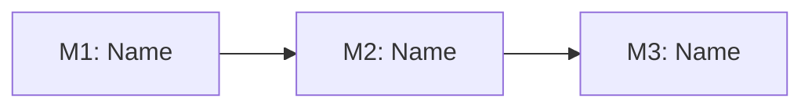

# Forge of Covenant — Grand Plan

## **PROJECT HEADER**
- **Project**: [Project Name]
- **Date**: [YYYY-MM-DD]
- **Agent Role**: [Agent role, e.g., Software Architect, Product Manager]
- **Vision**: [What are we creating and why — the core purpose]
- **Target Users**: [Who is this for]
- **Success Feeling**: [What does "done" look like for the user/creator — the motivating end state]
- **Source Protocol**: `/forge-of-covenant` — [Procedure](//@agent-memory/control-files/procedures/forge-of-covenant.md)

*CRITICAL INSTRUCTION: To continue this plan: load the source protocol above, then inspect which sections below are filled vs unfilled to infer your current step.*

---

## **What Are We Building?**
*The project's identity — what it is, why it exists, and what drives it. A new person should understand this project's reason to exist within 30 seconds.*

### Vision Statement
[1-3 sentences: what this project does, who it's for, and why it exists.]

### Purpose & Motivation
[Why does this project need to exist? What problem does it solve? What gap does it fill? Why now?]

### Core Idea
[The elevator pitch — if you had 30 seconds to explain this project to someone, what would you say?]

**How to fill**: This section captures the project's identity. Vision Statement is the "what", Purpose & Motivation is the "why", Core Idea is the pitch version. Fill from the exploration discussion — let the user's own words shape this. Keep it honest — if the motivation is "I want to learn X", say that.

---

## **Who's Involved?**
*The people landscape — who uses it, who decides, who builds. Understanding the human side prevents scope surprises and communication gaps.*

### Target Users
[Who will use this? Primary users, secondary users, personas, segments. Who benefits most?]

### Stakeholders

| Role | Who | Involvement | Key Concern |
|------|-----|-------------|-------------|
| Decision Maker | [Name/Team — who has final say on scope/direction] | [Approve milestones, resolve disputes] | [What they care most about] |
| Builder(s) | [Name/Team — who implements] | [Active every milestone] | [What they care most about] |
| End User(s) | [Persona/segment — who uses the product] | [Feedback at M1, M2 launch] | [What they care most about] |
| [Other role] | [Name/Team] | [When involved] | [What they care most about] |

### Team Structure
[Who builds, who reviews, solo vs team? For solo dev+AI projects, just acknowledge the lightweight setup. For teams, map roles and responsibilities.]

**How to fill**: Map the people. Target Users are who benefits — think personas, not names. Stakeholders are who influences — decision makers, builders, blockers. Team Structure is who executes. For solo projects, keep it lightweight (developer + AI + end users). "Key Concern" in the stakeholders table helps anticipate friction.

---

## **What Does Success Look Like?**
*Both the feeling and the numbers — what "done" looks like qualitatively and how we'll measure it quantitatively.*

### Success Feeling
[Imagine the project is done and people are using it. What does that look like? What makes the creator proud? Connect to the user's motivation.]

### Success Metrics

| # | Metric | Target | Measured At | How to Measure |
|---|--------|--------|-------------|----------------|
| 1 | [e.g., "Daily active users"] | [e.g., "500 DAU by M2 launch"] | [Milestone or date] | [Tool/method] |
| 2 | [e.g., "API response time"] | [e.g., "<200ms p95"] | [M1 onward] | [APM tool] |
| 3 | [e.g., "Test coverage"] | [e.g., ">80%"] | [Every milestone] | [CI pipeline] |

**How to fill**: Success Feeling is qualitative — the motivating end state that keeps the team going. Success Metrics are quantitative — 3-7 measurable KPIs. Include both business metrics (users, revenue, engagement) and technical metrics (performance, reliability, coverage). "Measured At" specifies when you'll first check this metric.

---

## **What's The Technical Shape?**
*The architecture landscape — what pieces exist, what technology they use, and how they connect.*

### Services & Components
[What services or components will this need? Backend, frontend, mobile app, APIs, database, infrastructure? List the major building blocks.]

### Tech Stack

- **Runtime**: [e.g., Node.js 20 + NestJS 10]
- **Database**: [e.g., PostgreSQL 16]
- **Frontend**: [e.g., React + Next.js]
- **Infrastructure**: [e.g., AWS, Docker, Kubernetes]
- **Other**: [Queue, cache, CDN, etc.]

### Architecture Overview

```
[Diagram or ASCII art showing how the major pieces connect]
```

**How to fill**: Services & Components maps the building blocks — each may appear across multiple milestones. Tech Stack lists the key technologies (not every npm package — just what someone needs to understand the project). Architecture Overview shows how pieces connect. If details are unknown early on, mark with `[TBD — decided during M1 planning]`.

---

## **What Are The Boundaries?**
*Everything that constrains, limits, or defines the project's non-negotiable commitments. Understanding boundaries early prevents scope creep and broken promises.*

### Constraints
[Budget limits? Timeline pressure? Team size? Technical constraints? Existing code to work with? Regulatory requirements?]

### Non-Negotiables / Principles
*Covenant-level promises that persist across ALL milestones. These are the project's "constitution" — they cannot be deferred or traded away.*

| # | Principle | Rationale |
|---|-----------|-----------|
| 1 | [e.g., "CI/CD pipeline from M1"] | [Why this is non-negotiable] |
| 2 | [e.g., "No launch without auth"] | [Why this is non-negotiable] |
| 3 | [e.g., "Mobile-first responsive design"] | [Why this is non-negotiable] |

### Timeline Pressure
[External deadlines? Dependencies on events outside the project? Seasonal windows? Competitive pressure? If none, state "No external timeline pressure — internal cadence."]

**How to fill**: Constraints are the "what limits us" — real-world limitations. Non-Negotiables are the "what we promise" — principles that must hold across every milestone. If a principle would only apply to one milestone, it belongs in that milestone's plan instead. Timeline Pressure captures external forces that affect scheduling.

---

## **What Could Go Wrong?**
*Risks, dependencies, and unknowns — the things that could derail the project. Identifying them early allows mitigation before they become crises.*

### Risk Register

| # | Risk | Likelihood | Impact | Mitigation | Owner | Status |
|---|------|-----------|--------|------------|-------|--------|
| 1 | [What could go wrong] | H/M/L | H/M/L | [How to prevent or respond] | [Who handles this] | OPEN |
| 2 | [What could go wrong] | H/M/L | H/M/L | [How to prevent or respond] | [Who handles this] | OPEN |

**Likelihood**: H (High — likely to happen), M (Medium — possible), L (Low — unlikely)
**Impact**: H (High — blocks milestone), M (Medium — delays or degrades), L (Low — minor inconvenience)
**Status values**: OPEN | MITIGATED | OCCURRED | CLOSED

### External Dependencies
[Third-party APIs, services, or people outside the project's control. What happens if they change, break, or become unavailable?]

### Known Unknowns
[Things we don't know yet that could matter. Technical unknowns, market unknowns, user behavior unknowns. Not risks per se — but gaps in understanding that need resolution.]

**How to fill**: Risk Register captures 3-5 key risks during planning. Focus on cross-milestone risks (e.g., "M1 API redesign delays M2 frontend") and external risks (e.g., "third-party API deprecation"). Update status during Covenant Reviews — risks that occurred become lessons learned. External Dependencies and Known Unknowns capture the broader uncertainty landscape.

---

## **How Do We Ship This?**
*The release strategy — how the project gets from idea to users' hands, milestone by milestone.*

### Release Strategy
[Incremental releases? Big bang? MVP first then iterate? Feature flags? How does the team think about shipping?]

### First Usable Version
[What does M1 look like? What's the minimum that delivers value? What gets deferred to make M1 achievable?]

### Milestone Vision
[How many releases are envisioned? What's the rough progression? How does each build on the previous one?]

**How to fill**: Release Strategy is the philosophy — how the team approaches shipping. First Usable Version focuses M1 — what's the smallest thing that delivers real value. Milestone Vision paints the big picture progression. These inform the Milestone Roadmap section below.

---

## **Project Decisions**
*These decisions were collected during project investigation (WAIT Options Round 1) and confirmed by [USER-NAME]. The reasons serve as the analysis record for foundational project choices.*

| # | Decision | Chosen | Reason |
|---|----------|--------|--------|
| 1 | [Decision topic] | [Chosen option] | [Evidence-based reason] |
| 2 | [Decision topic] | [Chosen option] | [Evidence-based reason] |

---

## **Milestone Roadmap**
*The core of the covenant — what will be built, in what order, and what each release contains. Each milestone is a versioned release that can contain multiple services (BE+FE+Mobile+Deploy+QA+Launch).*

| M# | Name | Goal | Key Deliverables | Target Scope | Target Date | Status |
|----|------|------|-----------------|--------------|-------------|--------|
| M1 | [Milestone name] | [What this release achieves] | [Main outputs] | [Services included, e.g., BE+FE+Deploy] | [YYYY-MM or rough] | NOT STARTED |
| M2 | [Milestone name] | [What this release achieves] | [Main outputs] | [Services included] | [YYYY-MM or rough] | NOT STARTED |
| M3 | [Milestone name] | [What this release achieves] | [Main outputs] | [Services included] | [YYYY-MM or rough] | NOT STARTED |

**Status values**: NOT STARTED | IN PROGRESS | DONE | BLOCKED (with reason in Execution Log)

**How to fill**: Each milestone = a versioned release. Goal is the "why" (user value), Key Deliverables is the "what" (concrete outputs), Target Scope is the "how big" (which services/components are included), Target Date is the "when" (even a rough month/quarter helps with planning — can be updated during Covenant Reviews). Order milestones by dependency — earlier milestones should enable later ones.

---

## **Scope Gate**
*Evaluate whether this project truly needs the Forge of Covenant (multi-milestone roadmap) or can be handled by a lower-level wizard.*

**Criteria** — Forge of Covenant is needed when ALL of these are true:
- [ ] Project spans **multiple milestones/releases** (not just one)
- [ ] Project involves **multiple services or components** across its lifecycle
- [ ] Project needs **cross-milestone tracking** (deferrals, debt, scope shifts)

**Assessment**: [Explain why this project meets/doesn't meet the criteria above]

**Decision**: [ ] Proceed with Forge of Covenant | [ ] De-escalate to `/rite-of-creation`

*If de-escalating to Rite of Creation: scope is actually a single milestone — delete this folder, launch `/rite-of-creation` with the vision and decisions already gathered above.*

---

## **Milestone Decisions**
*These decisions were collected during milestone detail planning (WAIT Options Round 3) and confirmed by [USER-NAME]. These are milestone-level decisions about HOW each milestone will be executed.*

| # | Milestone | Decision | Chosen | Reason |
|---|-----------|----------|--------|--------|
| 1 | M1 | [Decision topic] | [Chosen option] | [Evidence-based reason] |
| 2 | M1 | [Decision topic] | [Chosen option] | [Evidence-based reason] |
| 3 | M2 | [Decision topic] | [Chosen option] | [Evidence-based reason] |

---

## **Deferral & Debt Tracker**
*Living tracker of items moved between milestones and technical debt scheduled for resolution. Updated after each Covenant Review.*

| # | Item | Original Milestone | Moved To | Reason | Type |
|---|------|--------------------|----------|--------|------|
| 1 | [What was deferred/identified] | M1 | M2 | [Why it was moved/created] | deferral / debt |
| 2 | [What was deferred/identified] | M1 | M3 | [Why it was moved/created] | deferral / debt |

**Type values**: `deferral` (planned feature moved to later milestone) | `debt` (technical debt identified for future resolution)

**How to fill**: Add items whenever scope changes during milestone planning or execution. Update the "Moved To" column during Covenant Reviews if items shift again. Items resolved in their target milestone should be marked with a ~~strikethrough~~ and noted in the Covenant Review Log.

---

## **Milestone Dependency Graph**
*Mermaid diagram showing milestone relationships and what can overlap.*



**Parallel opportunities**: [List which milestones can overlap, e.g., "M2 frontend can start while M1 backend stabilizes"]

**Critical path**: [Identify the longest sequential chain that determines minimum total time]

**How to fill**: Draw dependencies based on which milestones produce outputs that later milestones depend on. Milestones with no dependency between them can overlap — highlight these opportunities.

---

## **Execution Log**
*Track progress of each milestone. This is the single source of truth for project-level progress. Each milestone's own plan file (created by the sub-protocol) has its own detailed execution log.*

**Execution Protocol for AI**:
I have to use this document as my **ONLY** source of truth to track which milestones are done and which are next. For each milestone, I launch `/rite-of-creation`, `/council-of-wizards`, `/high-wizard`, or `/quick-wizard` as appropriate, then update this log.

| Milestone | Status | Protocol Used | Plan File | Started | Completed | Notes |
|-----------|--------|--------------|-----------|---------|-----------|-------|
| M1 | NOT STARTED | — | — | — | — | — |
| M2 | NOT STARTED | — | — | — | — | — |
| M3 | NOT STARTED | — | — | — | — | — |

**Status values**: NOT STARTED → IN PROGRESS → DONE → BLOCKED (with reason in Notes)

**How to fill**: Update status as milestones progress. Protocol Used records which wizard was invoked. Plan File links to the plan file created by the sub-protocol inside the milestone's sub-folder (e.g., `M1-name/core-plan.md`).

---

## **Covenant Review Log**
*After each milestone completes, review the covenant: what changed, what shifted, what debt was resolved or created. This keeps the grand plan honest and living.*

### Review after M[X]: [Milestone Name]
- **Date**: [YYYY-MM-DD]
- **What changed**: [Scope shifts, new insights, adjusted timeline]
- **Deferrals updated**: [Items added/moved in Deferral & Debt Tracker]
- **Debt resolved**: [Items completed from the tracker]
- **Principles upheld**: [Confirm all non-negotiables still hold — flag any at risk]
- **Risks updated**: [Risks materialized/mitigated/closed, new risks identified]
- **Metrics check**: [Are success KPIs on track? Any needing attention?]
- **Roadmap adjustments**: [Changes to upcoming milestones, updated target dates]

**How to fill**: After completing each milestone, add a new review entry above. This is the "covenant check" — ensuring the project stays true to its vision and principles. If a principle is at risk, flag it prominently and discuss with [USER-NAME] before proceeding.

---

## **Project Completion Checklist**
*Final verification before marking the project complete.*

- [ ] All milestones have status DONE in Execution Log
- [ ] All principles/non-negotiables upheld throughout the project
- [ ] Deferral & Debt Tracker reviewed — no unresolved items remaining
- [ ] Cross-milestone integration verified end-to-end
- [ ] No BLOCKED milestones remaining
- [ ] Documentation complete (if applicable)
- [ ] [USER-NAME] confirms project is complete

---

## **Post-Completion**
After project is complete and checklist passes, move the entire covenant folder to `plans/completed/`:
`mkdir -p ./plans/completed && mv ./plans/[this-folder] ./plans/completed/[this-folder]`
