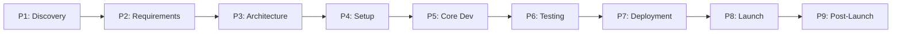

# Rite of Creation Plan

## **PROJECT VISION**
- **Project**: [Project Name]
- **Date**: [YYYY-MM-DD]
- **Agent Role**: [Agent role, e.g., Software Architect, Full-Stack Engineer]
- **Vision**: [What are we creating and why — the core purpose]
- **Target Users**: [Who is this for]
- **Success Feeling**: [What does "done" look like for the user/creator — the motivating end state]
- **Source Protocol**: `/rite-of-creation` — [Procedure](//@agent-memory/control-files/procedures/rite-of-creation.md)

*CRITICAL INSTRUCTION: To continue this plan: load the source protocol above, then inspect which sections below are filled vs unfilled to infer your current step.*

---

## **PROJECT DECISIONS**
*These decisions were collected during project investigation (WAIT Options Round 1) and confirmed by [USER-NAME]. The reasons serve as the analysis record for foundational project choices.*

| # | Decision | Chosen | Reason |
|---|----------|--------|--------|
| 1 | [Decision topic] | [Chosen option] | [Evidence-based reason] |
| 2 | [Decision topic] | [Chosen option] | [Evidence-based reason] |

---

## **PHASE MENU**
*Not all phases apply to every project. Agent proposes which phases to include based on project scope, [USER-NAME] confirms. Filled AFTER [USER-NAME] confirms Phase WAIT Options (Round 2).*

| # | Phase | Included | Protocol | Recommended Role | Rationale |
|---|-------|----------|----------|-----------------|-----------|
| 1 | Discovery & Vision | ✓ / — | CoW / HW / QW | Product Owner / Business Analyst | [Why include/skip] |
| 2 | Requirements & Specification | ✓ / — | CoW / HW / QW | Product Owner + Domain Expert | [Why include/skip] |
| 3 | Architecture & Design | ✓ / — | CoW / HW / QW | Software Architect | [Why include/skip] |
| 4 | Project Setup / Scaffolding | ✓ / — | CoW / HW / QW | Domain Engineer | [Why include/skip] |
| 5 | Core Development (MVP) | ✓ / — | CoW / HW / QW | Domain Engineer(s) | [Why include/skip] |
| 6 | Testing & QA | ✓ / — | CoW / HW / QW | QA Engineer | [Why include/skip] |
| 7 | Deployment & Infrastructure | ✓ / — | CoW / HW / QW | DevOps / Infrastructure Engineer | [Why include/skip] |
| 8 | Launch / Go-Live | ✓ / — | CoW / HW / QW | Product Owner + Domain Engineer | [Why include/skip] |
| 9 | Post-Launch / Operations | ✓ / — | CoW / HW / QW | Domain Engineer + QA Engineer | [Why include/skip] |

**How to fill**: For each phase, mark ✓ (included) or — (skipped). Choose protocol level: `/council-of-wizards` (CoW) for complex phases with multiple features, `/high-wizard` (HW) for single-deliverable phases, `/quick-wizard` (QW) for simple phases. Recommended Role suggests which agent role is best suited. Protocol and Role columns are filled based on confirmed Phase WAIT Options.

---

## **SCOPE GATE**
*Evaluate whether this project truly needs the Rite of Creation (full lifecycle orchestration) or can be handled by a lower-level wizard.*

**Criteria** — Rite of Creation is needed when ANY of these are true:
- [ ] Project requires **multiple SDLC phases** (not just one)
- [ ] Project scope spans **architecture + implementation + delivery**
- [ ] **At least one phase requires Council-level coordination** (CoW) — if all phases are HW/QW, a single CoW suffices instead of RoC

**Assessment**: [Explain why this project meets/doesn't meet the criteria above]

**Decision**: [ ] Proceed with Rite of Creation | [ ] De-escalate to `/council-of-wizards` | [ ] De-escalate to `/high-wizard`

*If de-escalating to Council: scope is actually a single phase — delete this folder, launch `/council-of-wizards` with the decisions already gathered above.*
*If de-escalating to HW: scope is a single deliverable — delete this folder, launch `/high-wizard` with the decisions already gathered above.*

---

## **PHASE EXIT CRITERIA**
*Each phase must produce specific deliverables before the next phase can begin. These are the "phase gates" — structural enforcement that prevents premature progression. Only include rows for phases marked ✓ in the Phase Menu.*

| Phase | Exit Deliverables | Status |
|-------|------------------|--------|
| Discovery & Vision | Vision document, target audience defined, feasibility confirmed | [ ] |
| Requirements & Specification | Requirements document, user stories, acceptance criteria, MVP scope defined | [ ] |
| Architecture & Design | Architecture document, tech stack selected, DB design, API specification | [ ] |
| Project Setup / Scaffolding | Working repository, CI/CD pipeline, dev environment, boilerplate code | [ ] |
| Core Development (MVP) | Working MVP with core features implemented | [ ] |
| Testing & QA | Test suite passing, QA report, critical bugs resolved | [ ] |
| Deployment & Infrastructure | Deployed to staging/production, monitoring active | [ ] |
| Launch / Go-Live | Live product, rollback plan tested, user communication sent | [ ] |
| Post-Launch / Operations | Monitoring dashboard active, feedback loop established, maintenance plan | [ ] |

**How to fill**: Remove rows for phases not included in the Phase Menu. Customize exit deliverables based on the specific project. The Status column is checked during Phase Execution when the phase completes and its deliverables are verified.

---

## **PHASE DEPENDENCY GRAPH**
*Mermaid diagram showing phase relationships. Most phases are sequential but some can overlap.*

**Parallel opportunities**: [List which phases can overlap, e.g., "Architecture and Setup can partially overlap — repo setup can start while finalizing design. Development and Testing overlap naturally via TDD/CI."]

**Critical path**: [Identify the longest sequential chain that determines minimum total time]

**How to fill**: Remove nodes for phases not included in the Phase Menu. Adjust arrows to reflect actual dependencies — some phases may have parallel opportunities. The critical path is the longest chain of sequential dependencies.

---

## **EXECUTION LOG**
*Track progress of each phase. This is the single source of truth for project-level progress. Each phase's own plan file (created by the sub-protocol) has its own detailed execution log.*

**Execution Protocol for AI**:
I have to use this document as my **ONLY** source of truth to track which phases are done and which are next. For each phase, I launch `/council-of-wizards`, `/high-wizard`, or `/quick-wizard` as specified in the Phase Menu, then update this log. Phases can overlap if the dependency graph allows.

| Phase | Status | Protocol Used | Plan File | Started | Completed | Notes |
|-------|--------|--------------|-----------|---------|-----------|-------|
| Discovery & Vision | NOT STARTED | — | — | — | — | — |
| Requirements & Specification | NOT STARTED | — | — | — | — | — |
| Architecture & Design | NOT STARTED | — | — | — | — | — |
| Project Setup / Scaffolding | NOT STARTED | — | — | — | — | — |
| Core Development (MVP) | NOT STARTED | — | — | — | — | — |
| Testing & QA | NOT STARTED | — | — | — | — | — |
| Deployment & Infrastructure | NOT STARTED | — | — | — | — | — |
| Launch / Go-Live | NOT STARTED | — | — | — | — | — |
| Post-Launch / Operations | NOT STARTED | — | — | — | — | — |

**Status values**: NOT STARTED → IN PROGRESS → DONE → BLOCKED (with reason in Notes)

**How to fill**: Remove rows for phases not included in the Phase Menu. Update status as phases progress. Plan File links to the actual plan file created by the sub-protocol inside this rite folder.

---

## **PROJECT COMPLETION CHECKLIST**
*Final verification before marking the project complete.*

- [ ] All included phases have status DONE in Execution Log
- [ ] All phase exit criteria verified (Status column checked)
- [ ] Cross-phase integration tested end-to-end
- [ ] No BLOCKED phases remaining
- [ ] Documentation complete (if applicable)
- [ ] [USER-NAME] confirms project is complete

---

## **POST-COMPLETION**
After project is complete and checklist passes, move the entire rite folder to `plans/completed/`:
`mkdir -p ./plans/completed && mv ./plans/[this-folder] ./plans/completed/[this-folder]`
