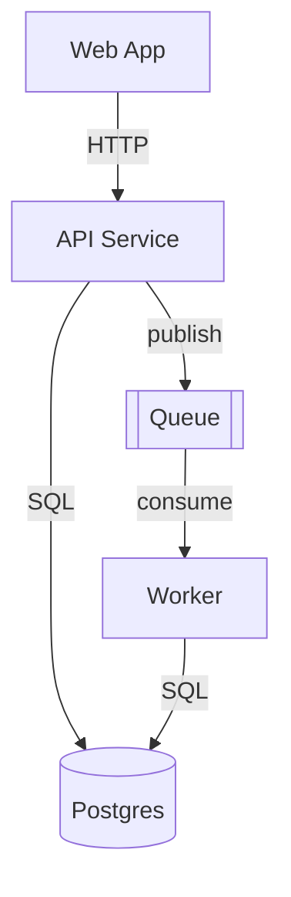

# Architecture: [Scope Name]

<!-- ============================================================
  ARCHITECTURE DOC TEMPLATE — the component/structure lens, two altitudes

  HOW TO USE:
  1. Pick the altitude and set `doc_type` in the frontmatter:
     - architecture-map      → whole-project: the system's components + how they connect
     - architecture-overview → one subsystem: its internal structure/layers
  2. Copy this file to [LCA]/docs/architecture/[scope-name].md
     (architecture-map lives at project root docs/architecture/;
      an architecture-overview co-locates at its subsystem's LCA)
  3. Read the Convention section below, then delete it
  4. Fill each section from ACTUAL structure (folders, dependency graph,
     deployment/service config) — delete the HTML comments as you go
  5. Keep it honest — [TODO]/[CONFIRM]/[NOT FOUND] markers, never invent components
============================================================ -->

> **Documentation Convention** *(delete this section after reading)*
>
> This is an **architecture doc** — it captures the *component/structure* lens: what the parts are, their responsibilities/boundaries, and how they connect + deploy. It is NOT a behavior sequence (flow doc) and NOT the data model (domain doc).
>
> **Two altitudes** (fractal, like READMEs):
> - **architecture-map** (`doc_type: architecture-map`) — the WHOLE system as components/containers. A handful of boxes + how they connect. Not internals.
> - **architecture-overview** (`doc_type: architecture-overview`) — ONE subsystem's internal structure (layers, key modules). Don't mix altitudes.
>
> **Placement** (see [ADR-004](//@agent-memory/docs/adr/2026-07-06-docs-placement-contract.md)): a map is project-root-scoped (`docs/architecture/`); an overview lives at its subsystem's LCA. Never invent a parent folder.
>
> **Diagram**: Mermaid. `flowchart` (default — component boxes + labelled dependency arrows) for most; `C4Context`/`C4Container` when the system has clear external actors + containers. Show *how components connect + deploy* (the value), not just a list. For a sharable render, extract the fenced block to `.mmd` and run `mmdc -i arch.mmd -o arch.svg`.
>
> **Markers**: `[TODO: ...]` needs human input · `[CONFIRM: ...]` an inferred boundary (folder layout vs actual imports) · `[NOT FOUND: ...]` expected but not locatable (e.g. no deployment config).

---

**Altitude**: <!-- architecture-map (whole system) | architecture-overview (one subsystem) -->
**Scope**: <!-- the whole project, or the subsystem this covers -->
**Type**: <!-- flowchart | C4Context | C4Container — plus one line on why -->
**Components**: <!-- count + names, e.g. 5 — API, Worker, Web, Postgres, Queue -->

---

## Diagram

<!-- tip: label the arrows with HOW components talk (sync HTTP, async queue, DB read). Show process/network boundaries. Keep a map to ~a dozen boxes; split into overviews if bigger. -->

## Components

<!-- tip: one entry per component — its responsibility + boundary + where it lives. -->

- **[Component]** — [responsibility]; boundary: [process/service/module]; lives in [`path`](path/to/component)

## Dependencies & Boundaries

<!-- tip: how components connect (sync/async, protocols), deployment topology, and the key cross-boundary contracts. This is the part only this doc gives. -->

- **[A] → [B]**: [sync HTTP / async queue / shared DB] — [what crosses the boundary]
- **Deployment**: [how/where these run — containers, services, serverless]
- **Key boundaries**: [process/network/trust boundaries that matter]

## Related

<!-- tip: link the subsystem overviews (from a map), the module READMEs, relevant flow/domain docs, and architecture ADRs. Use markdown links. -->

- [Subsystem overview / module README](path/to/README.md)
- [Related flow](path/to/flow.md) · [Related domain model](path/to/domain.md)
