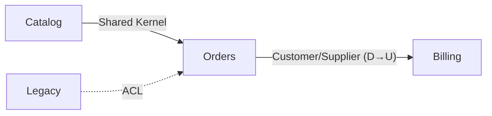

# Domain Context Map: [Scope Name]

<!-- ============================================================
  DOMAIN CONTEXT MAP TEMPLATE — the MAP altitude of the domain lens

  HOW TO USE:
  1. This is the whole-system view of the data/domain: how the bounded
     contexts relate (DDD context mapping). (The deep-dive is one context's
     ERD — see /generate-domain-docs.)
  2. Copy to the project root docs/domain/context-map.md
  3. Read the Convention section below, then delete it
  4. Fill from ACTUAL bounded contexts (modules/packages with their own models)
     + cross-context references — delete comments as you go
  5. Keep the frontmatter `doc_type: domain-context-map` — the orientation map keys on it
  6. Keep it honest — [TODO]/[CONFIRM]/[NOT FOUND] markers, never invent a relationship
============================================================ -->

> **Documentation Convention** *(delete this section after reading)*
>
> This is a **domain context-map** — the *map altitude* of the domain lens (ADR-007): how bounded contexts relate, not one context's entities. It is a **content map of the system**, distinct from the orientation map (navigation).
>
> **Placement** (see [ADR-004](//@agent-memory/docs/adr/2026-07-06-docs-placement-contract.md)): project-wide → root `docs/domain/context-map.md`. The per-context ERDs live in the same `docs/domain/` folder.
>
> **Diagram**: Mermaid `flowchart` — contexts as nodes, edges labelled with the **DDD relationship pattern**: upstream/downstream (U/D), shared kernel, customer/supplier, conformist, anti-corruption layer (ACL), open-host service (OHS), published language. These are design intentions code doesn't always spell out — `[CONFIRM]` where the pattern isn't clear.

---

**Scope**: <!-- the whole project, or a bounded area -->
**Type**: `flowchart`
**Contexts**: <!-- count + names, e.g. 4 — Orders, Billing, Catalog, Identity -->

---

## Diagram

<!-- tip: nodes are bounded contexts (link each to its own ERD where one exists). Label edges with the DDD pattern + direction. -->

## Contexts

<!-- tip: one line per context — its responsibility + where it lives. -->

- **[Context]** — [responsibility] ([context module](path/to/context))

## Relationships

<!-- tip: name each relationship's pattern + what crosses the boundary. -->

- **[A] → [B]**: [upstream/downstream · shared kernel · customer/supplier · conformist · ACL · OHS] — [what integrates, and how the boundary is protected]

## Related

<!-- tip: link each context's own ERD deep-dive; note contexts that lack one. -->

- [Domain: A](domain/a.md) · [Domain: B](domain/b.md)
