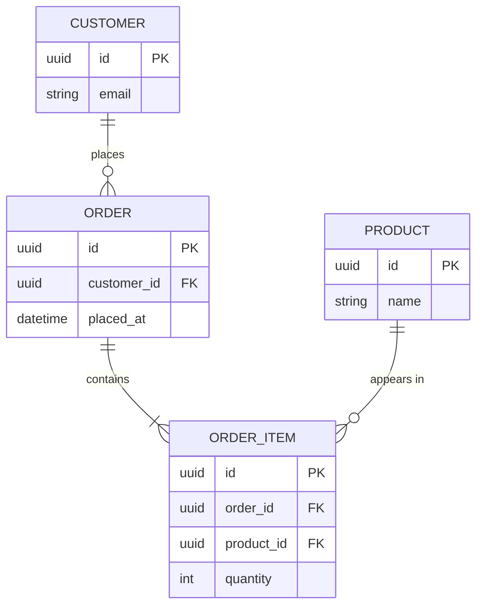

# Domain: [Scope Name]

<!-- ============================================================
  DOMAIN DOC TEMPLATE — documents ONE data model (a bounded context or project)

  HOW TO USE:
  1. Copy this file to [LCA]/docs/domain/[scope-name].md
     (LCA = nearest EXISTING folder containing the entity files this model
      covers; a single-module model co-locates in that module's docs/domain/)
  2. Read the Convention section below, then delete it
  3. Fill each section from ACTUAL code (ORM entities / migrations / schema) —
     delete the HTML comments as you go
  4. Keep the frontmatter `doc_type: domain` — the orientation map keys on it
  5. Keep it honest — use [TODO]/[CONFIRM]/[NOT FOUND] markers, never invent entities
============================================================ -->

> **Documentation Convention** *(delete this section after reading)*
>
> This is a **domain doc** — it captures ONE data model's *structure at rest* (entities + relationships). It is NOT a behavior sequence (that's a flow doc) and NOT the component/deployment structure (that's an architecture doc).
>
> **Placement** (see [ADR-004](//@agent-memory/docs/adr/2026-07-06-docs-placement-contract.md)): a domain doc lives at the **Lowest Common Ancestor** of the entity files it covers. A model contained in one module co-locates in that module's `docs/domain/`; a model shared across modules lives at their nearest common ancestor's `docs/domain/`. Never invent a parent folder.
>
> **Diagram**: Mermaid. `erDiagram` (default — entities + relationships + cardinality) for data/persistence models; `classDiagram` for behavior-rich OO domains (aggregates with methods, inheritance). Show **key fields + relationship-bearing fields**, not every column — the full schema lives in the migrations/entities you link to. For a sharable render, extract the fenced block to `.mmd` and run `mmdc -i model.mmd -o model.svg` (vector; avoid raster PNG for dense diagrams).
>
> **Markers**: `[TODO: ...]` needs human input · `[CONFIRM: ...]` found but unverified (especially a cardinality that isn't explicit in code) · `[NOT FOUND: ...]` expected but not locatable.

---

**Scope**: <!-- what this model covers — a bounded context, a module, or the whole project -->
**Type**: <!-- erDiagram | classDiagram — plus one line on why this grammar fits -->
**Entities**: <!-- count + names, e.g. 4 — Customer, Order, OrderItem, Product -->

---

## Diagram

<!-- tip: show key fields (PK/FK + relationship-bearing) not every column. Collapse pure join tables into an M:N relationship; keep them explicit only if they carry business attributes. -->

## Entities

<!-- tip: OPTIONAL — one line per entity: its purpose + the file it lives in. Include only if the entity names aren't self-explanatory. -->

- **[Entity]** — [purpose] ([entity file](path/to/entity))

## Relationships & Invariants

<!-- tip: the cardinalities and the business rules the schema enforces (or assumes). Call out M:N join tables, cascade deletes, uniqueness constraints, soft-deletes. -->

- **[Entity] → [Entity]**: [1:1 / 1:N / M:N] — [what it means]
- **Invariants**: [uniqueness, required FKs, cascade behavior, soft-delete, etc.]

## Related

<!-- tip: link the module README(s) that own these entities, the migrations folder, and any ADRs about the data model. Use markdown links, not bare paths. -->

- [Owning module README](path/to/README.md)
- [Migrations](path/to/migrations/)
