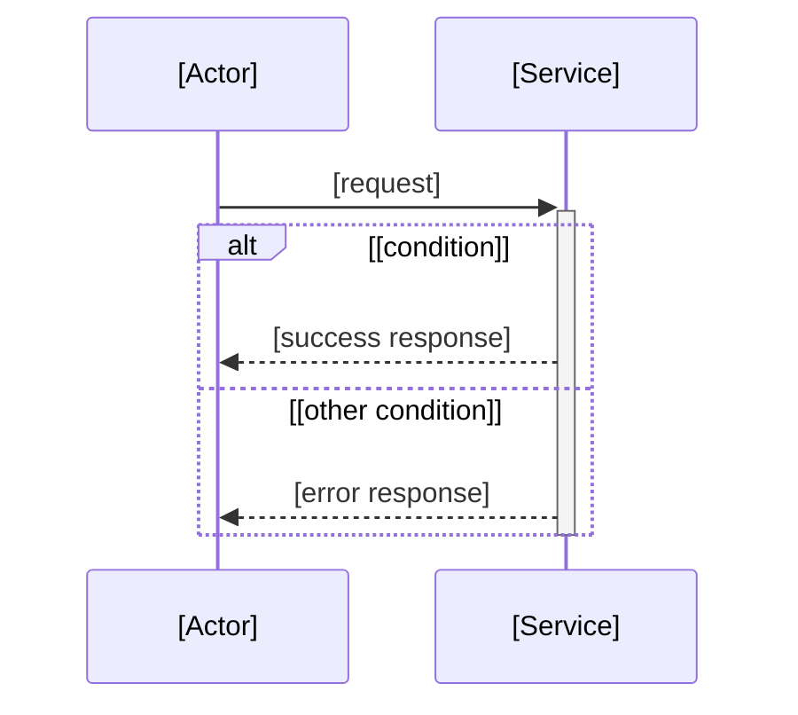

# Flow: [Flow Name]

<!-- ============================================================
  FLOW DOC TEMPLATE — documents ONE flow's behavior over time

  HOW TO USE:
  1. Copy this file to [LCA]/docs/flows/[flow-name].md
     (LCA = nearest EXISTING folder containing every file the flow runs
      through; a single-module flow co-locates in that module's docs/flows/)
  2. Read the Convention section below, then delete it
  3. Fill each section from ACTUAL code — delete the HTML comments as you go
  4. Keep the frontmatter `doc_type: flow` — the orientation map keys on it
  5. Keep it honest — use [TODO]/[CONFIRM]/[NOT FOUND] markers, never invent steps
============================================================ -->

> **Documentation Convention** *(delete this section after reading)*
>
> This is a **flow doc** — it captures ONE flow's *behavior over time* (a sequence). It is NOT a data model (that's a domain/ERD doc) and NOT the component structure (that's an architecture doc).
>
> **Placement** (see [ADR-004](//@agent-memory/docs/adr/2026-07-06-docs-placement-contract.md)): a flow doc lives at the **Lowest Common Ancestor** of the files the flow actually runs through. A flow contained in one module co-locates in that module's `docs/flows/`; a flow that spans modules lives at their nearest common ancestor's `docs/flows/`. Never invent a parent folder.
>
> **Diagram**: Mermaid. Pick the grammar that fits — `sequenceDiagram` (multi-participant interaction, the default), `flowchart` (branch-heavy single-actor logic), `stateDiagram-v2` (lifecycle / state transitions). For a sharable render, extract the fenced block to `.mmd` and run `mmdc -i flow.mmd -o flow.svg` (vector; avoid raster PNG for dense diagrams).
>
> **Markers**: `[TODO: ...]` needs human input · `[CONFIRM: ...]` found but unverified · `[NOT FOUND: ...]` expected but not locatable in code.

---

**Trigger**: <!-- what starts this flow — an HTTP route, a cron schedule, a queue message, a CLI command, a user action -->
**Type**: <!-- sequenceDiagram | flowchart | stateDiagram-v2 — plus one line on why this grammar fits -->
**Participants**: <!-- the actors/modules/services/externals involved, e.g. Client, API (orders controller), OrderService, Postgres, Stripe -->

---

## Diagram

<!-- tip: alt-block rule — a participant activated BEFORE an `alt` stays active through ALL branches; deactivate AFTER `end`, never inside a branch (avoids "inactivate an inactive participant" errors). -->

## Steps

<!-- tip: OPTIONAL — include only for non-trivial flows where the diagram alone isn't self-explanatory. Number the steps to match the diagram order; name the file/function each step lives in. -->

1. [Step — what happens, in which file/function]
2. [Step]

## Preconditions & Notes

<!-- tip: what must be true before the flow runs, key branch/error paths, retries, idempotency, async boundaries, external dependencies. -->

- **Preconditions**: [auth, feature flags, required state]
- **Branches / errors**: [what happens on failure — retries, fallbacks, compensating actions]
- **External dependencies**: [DBs, queues, caches, third-party APIs the flow touches]

## Related

<!-- tip: link the README(s) of the modules this flow crosses, sibling flows, and any ADRs that shaped it. Use markdown links, not bare paths. -->

- [Related module README](path/to/README.md)
- [Related flow](path/to/other-flow.md)
