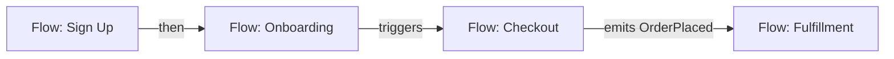

# Flow Journey Map: [Scope Name]

<!-- ============================================================
  FLOW JOURNEY MAP TEMPLATE — the MAP altitude of the flow lens

  HOW TO USE:
  1. This is the whole-system view of behavior: how the individual flows
     chain into user journeys. (The deep-dive is one flow — see /generate-flow-docs.)
  2. Copy to the project root docs/flows/journey-map.md
  3. Read the Convention section below, then delete it
  4. Fill from ACTUAL flows (existing docs/flows/*.md + entrypoint scan) — delete comments as you go
  5. Keep the frontmatter `doc_type: flow-journey-map` — the orientation map keys on it
  6. Keep it honest — [TODO]/[CONFIRM]/[NOT FOUND] markers, never invent a chain
============================================================ -->

> **Documentation Convention** *(delete this section after reading)*
>
> This is a **flow journey-map** — the *map altitude* of the flow lens (ADR-007): how flows chain into journeys, not one flow's internals. It is a **content map of the system**, distinct from the orientation map (which is navigation).
>
> **Placement** (see [ADR-004](//@agent-memory/docs/adr/2026-07-06-docs-placement-contract.md)): the journey-map is project-wide → root `docs/flows/journey-map.md`. The individual flow docs live in the same `docs/flows/` folder.
>
> **Diagram**: Mermaid `flowchart` — flows as nodes, edges = how one flow hands off to the next (`then` / `triggers` / `emits event`). Chains are often implicit (an event one flow emits, another consumes; a redirect on success). `[CONFIRM]` inferred chains.

---

**Scope**: <!-- the whole project, or a bounded area -->
**Type**: `flowchart`
**Flows**: <!-- count + names, e.g. 5 — Sign Up, Onboarding, Checkout, Fulfillment, Refund -->

---

## Diagram

<!-- tip: nodes are flows (link each to its own flow doc where one exists). Label edges with the handoff mechanism. -->

## Journeys

<!-- tip: name the end-to-end journeys — the chains that matter to a user/business. -->

- **[Journey name]**: [Flow A] → [Flow B] → [Flow C] — [what the user accomplishes]

## Related

<!-- tip: link each flow's own deep-dive doc; note flows that lack one. -->

- [Flow: A](flows/a.md) · [Flow: B](flows/b.md)
